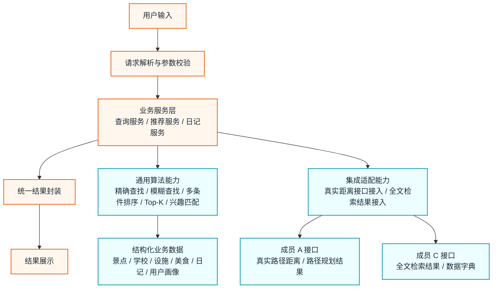

# 成员 B 细化架构图

这张图用于说明成员 B 负责的查询、推荐和日记逻辑是如何组织的，适合放在 PPT 的“模块设计”部分。

---

## 1. Mermaid 细化图

---

## 2. 图示说明

这张图重点展示成员 B 的内部逻辑，不再展开所有子算法节点，因此看起来更干净。

### 输入与输出主链路

- 用户输入先进入“请求解析与参数校验”
- 再进入业务服务层
- 最后统一封装结果并展示

这条主链路体现了成员 B 是“业务交互中心”。

### 通用算法能力

这部分是成员 B 需要重点自己实现的算法能力，包括：

- 精确查找
- 模糊查找
- 多条件排序
- Top-K 推荐
- 兴趣匹配

这些能力会被景点查询、美食推荐、日记推荐等多个功能复用。

### 集成适配能力

这部分负责把成员 B 的业务逻辑和其他组员提供的能力对接起来。

主要包括：

- 接入成员 A 的真实距离接口
- 接入成员 C 的全文检索结果

### 资源来源

- 结构化业务数据主要由成员 C 提供
- 路径和距离能力主要由成员 A 提供

---

## 3. 适合在 PPT 里讲什么

推荐讲这三个点：

1. 成员 B 的主链路是“输入 -> 解析 -> 服务 -> 结果封装 -> 展示”
2. 成员 B 的算法能力是通用能力，可被多个业务模块复用
3. 成员 B 通过集成适配层，把成员 A 的距离能力和成员 C 的检索能力组织进统一业务流程
