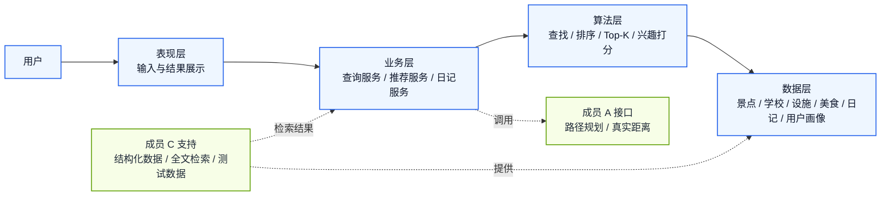

# 系统总览分层架构图

这张图用于说明整个个性化旅游系统的总体结构，重点展示四层分工以及成员 A、成员 B、成员 C 的协作关系。

建议和 `docs/architecture/成员B细化架构图.md` 配套使用：

- 先展示本图，建立整体结构认识
- 再展示成员 B 细化图，解释查询、推荐和日记模块如何协作

---

## 1. Mermaid 总览图

---

## 2. 图示说明

这张图只保留最关键的结构关系，适合在讲解时先建立全局认识。

### 表现层

- 接收用户输入
- 展示查询、推荐和日记结果
- 不直接处理复杂算法

### 业务层

- 由成员 B 重点负责
- 负责把用户需求翻译成具体的查询、推荐和日记处理流程

### 算法层

- 支撑成员 B 的核心能力
- 包括查找、排序、Top-K 和兴趣匹配

### 数据层

- 存放景点、学校、设施、美食、日记和用户画像等数据
- 主要由成员 C 组织和提供

### 外部协作接口

- 成员 A 提供真实路径距离和路径规划相关能力
- 成员 C 提供结构化数据、全文检索结果和测试数据支持

---

## 3. 适合在 PPT 里讲什么

推荐只讲三个点：

1. 整个系统按“表现层 - 业务层 - 算法层 - 数据层”组织，结构清晰
2. 成员 B 是业务层核心，负责把查询与推荐逻辑串起来
3. 成员 B 同时依赖成员 A 的距离能力和成员 C 的数据能力

---

## 4. 展示与导出建议

建议在 PPT 中按下面顺序展示：

1. 先放 `docs/architecture/系统总览分层架构图.md`
2. 再放 `docs/architecture/成员B细化架构图.md`

这样做的好处是：

- 先讲全局，再讲局部，逻辑更顺
- 每页只承载一层重点，不会过于拥挤
- 更适合 16:9 的 PPT 页面布局

如果需要清晰放大展示，优先使用 Mermaid 原图导出 `SVG`，不要直接截图。
